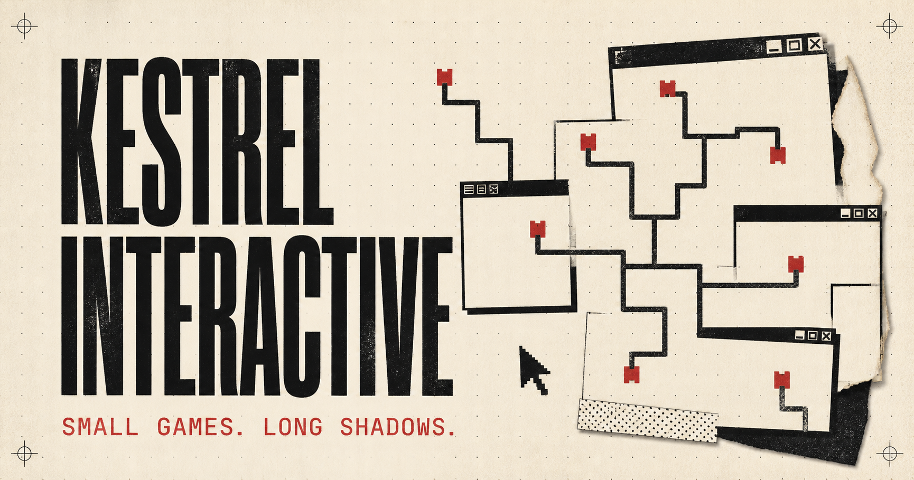

# Kestrel Interactive Archive



**八款小游戏。一段漫长的阴影。**

一个伪装成失落独立游戏门户的浏览器元游戏选集。每款游戏都能独立游玩，但它们会通过本地共享存档、URL、页面标题、焦点状态与隐藏文件，逐渐拼出同一个谜团。

`English / 简体中文` · `8 fully playable games` · `local-first` · `multiple endings`

### [▶ 立即试玩 / PLAY NOW](https://kestrel-interactive-archive.qadgunn.chatgpt.site/)

> 最好的入口是毫无准备地从首页开始。请不要先打开剧透文件。

## 这不只是八个小游戏

- 共享持久化状态会让游戏彼此记住玩家的选择。
- 门户、搜索、评论、开发者档案与隐藏路径都会随进度改变。
- URL、浏览器前进后退、页面焦点和标签标题本身也是玩法的一部分。
- 三个可收集结局最终通向隐藏的 ADMIN 体验。
- 所有叙事状态都保存在当前浏览器中，不需要账号或后端。

## 游戏目录

| 游戏 | 表面上看起来像…… |
| --- | --- |
| **CLICK** | 一场简单、诚实、绝对不会记仇的点击挑战 |
| **404** | 在不存在的页面之间寻找一条可用路径 |
| **TERMS & CONDITIONS** | 一份只需要勾选“同意”的普通协议 |
| **HUMAN TEST** | 证明你不是机器，或者证明题目有问题 |
| **WINDOW** | 移动一扇窗口，观察它不愿展示的东西 |
| **DON'T LOOK AWAY** | 只要保持注视，什么都不会发生 |
| **THE QUIZ** | 回答一些你理应已经知道的问题 |
| **PATCH NOTES** | 把一次失败更新的记录重新排列完整 |

## 本地试玩

需要 Node.js 22.13 或更高版本。

```bash
npm install
npm run dev
```

质量检查：

```bash
npm run lint
npm test
npm run build
```

## 简体中文

首次访问会跟随浏览器语言，也可以随时在界面中切换；选择保存在本地。门户、八款游戏、成就、隐藏文件、ADMIN 与结局均有完整的 English / 简体中文内容。

## 隐私与安全边界

游戏状态只保存在当前浏览器的 `localStorage`。项目不会访问摄像头、麦克风、浏览历史、联系人、账户信息或其他敏感数据。需要注意力与页面焦点的玩法只使用游戏区域内的指针位置，以及标准的页面可见性 / 焦点事件。

ADMIN 路由、成就、解锁条件与结局都是由客户端本地状态驱动的单机叙事机制，不是权限系统或安全边界；玩家可以使用浏览器开发者工具修改这些状态。

## 剧透与设定

完整英文设定、时间线与线索账本位于 [SPOILERS.md](./SPOILERS.md)。简体中文版位于 [SPOILERS.zh-CN.md](./SPOILERS.zh-CN.md)。

---

An experimental browser-game anthology disguised as a forgotten indie portal. Eight standalone games share a local state machine and slowly rewrite the archive around them. Fully playable in English and Simplified Chinese.

This public repository is presented as a portfolio piece. No license is granted for reuse or redistribution.
